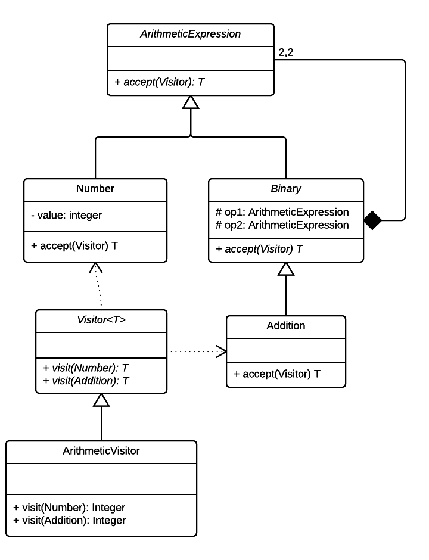

### Composite & Interpreter pattern

#### Structural - Behavioral

Visitor:

Represent an operation to be
performed on the elements of an
object structure. Lets you define a
new operation without changing 
the classes of the elements on
which it operates.

Composite:

Compose objects into tree structures to
represent part-whole hierarchies. Lets
clients treat individual objects and
compositions of objects uniformly.

Source code stems from the following UML diagram:

